# 说明

报告借助CODEX完成

模型搭建以及报告分别参考了下面。

**电路模型参考来源：**

[三相电压源型SPWM逆变器仿真设计与分析 - 电源论坛](http://www.51hei.com/bbs/dpj-109197-1.html)

**LC电容滤波取值参考论文**：逆变器输出滤波器设计及电感分析研究——谭丽平 长沙理工大学

[原版阅读-逆变器输出滤波器设计及电感分析研究](https://kns.cnki.net/reader/flowpdf?invoice=e6DizpSRktj%2FVOMcwML6eLmO4pTZ4RZzzQMEkrstHUkaAPwZLi2FU%2FJXo0cbU3KZXOmyOe%2FhXb18K5tp%2FbSZ1ZGOzPCnn7KbNqapKhyP34q%2B9dEeOt7LBX7YhLO4fAt%2BPvFrKcK2X7n4JmMLJ5lDQvJKGwRNxV2p3Hpz4vVKIGc%3D&platform=NZKPT&sourcetype=nxgp&product=CMFD&filename=1012274155.nh&tablename=cmfd2012&type=DISSERTATION&scope=trial&cflag=overlay&dflag=pdf&pages=&language=CHS&trial=&nonce=F6FEDE921AB140DBA5F4FD0666C4F2F9)

另一个可能有用的——三相PWM逆变器输出LC滤波器设计方法——何亮 王劲松

**FFT分析使用参考：**

[simulink示波器中的数据导入powrgui中进行快速fft分析 - 知乎](https://zhuanlan.zhihu.com/p/462001433)

# 模型搭建

在参考来源基础上加入On delay 开通延时模块，加入死区时间。

注意：加入该模块会使得负载输出电压有所下降。验证的时候可以先注释直通掉。

# 滤波参数设计

采用的是LC低通滤波器，根据参考论文步骤求取：

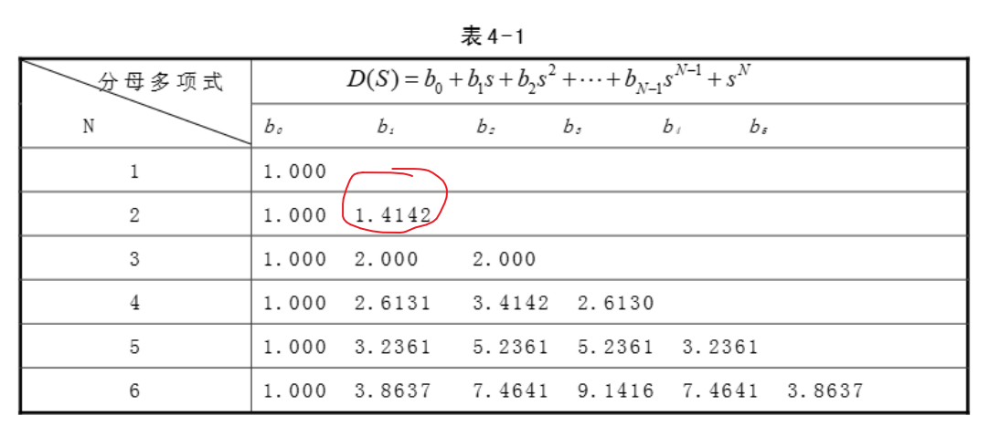

模型中，我们确定：负载纯电阻20Ω，载波取10KHZ。具体步骤等自行阅读论文部分。最终计算结果有L=4.501mh，C=10.026μf；

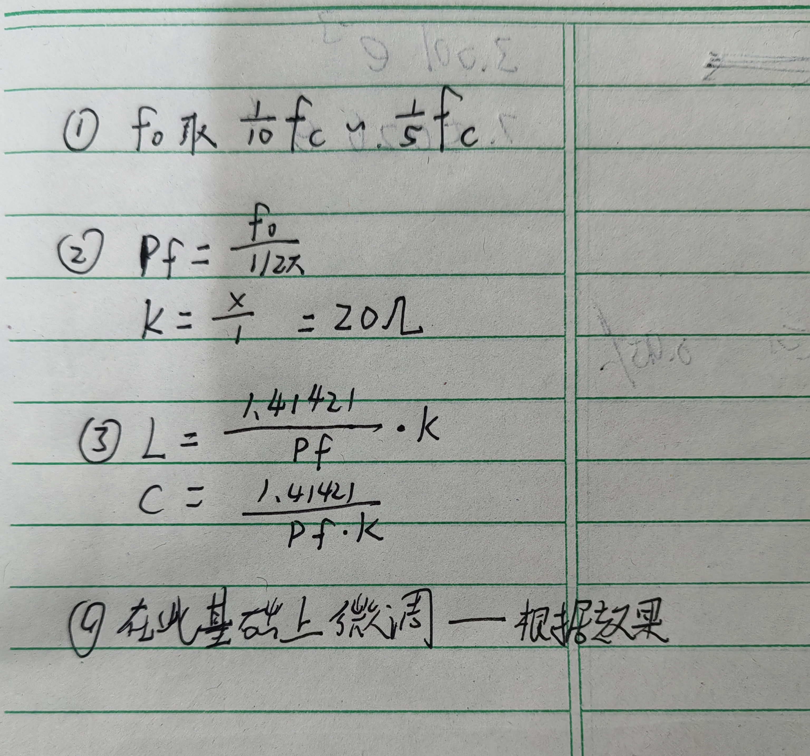

# 实验要求

 仿真实验评分标准 

必须具有对应仿真实验原理的理论分析及定量计算推导（25%）； 

仿真实验原理图及其工作原理分析（20%）； 

 (3-8个，甚至更多)典型信号波形图（10%）；

实验数据图表及其详细理论计算分析（20%）； 

实验数据曲线图（10%）； 

实验数据误差分析（10%）； 

实验结论（5%）

## 功能：

完整实现调频和调压功能

## 波形：

三相正弦信号、三角载波信号、SPWM信号、桥臂信号（死区）、桥路输出波形、滤波后的波形

为了更好的观测和验证波形，我们这里确定一些参数：

Ud=200V，调制比为1，调制波频率为50HZ、幅值1；载波幅值1、频率取500HZ；载波比为10。

关于滤波后的波形，我们取调制比频率为10kHZ。

### 三相正弦信号&三角载波信号

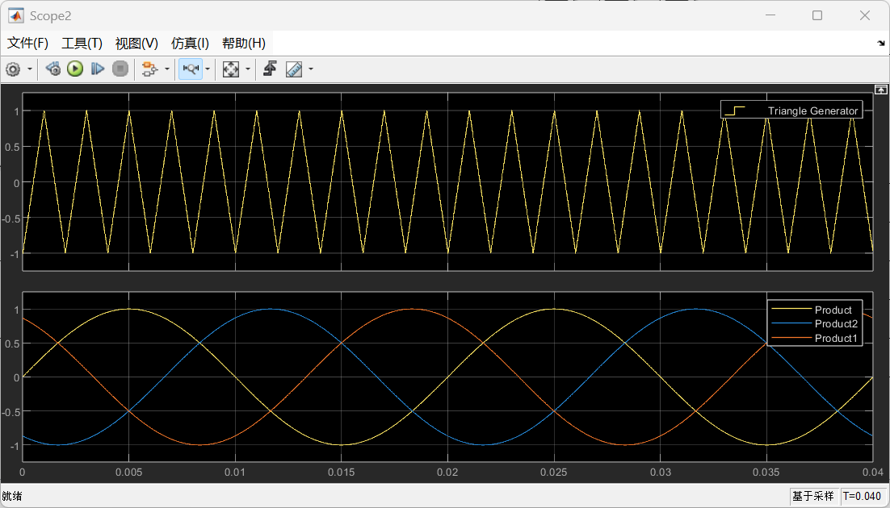

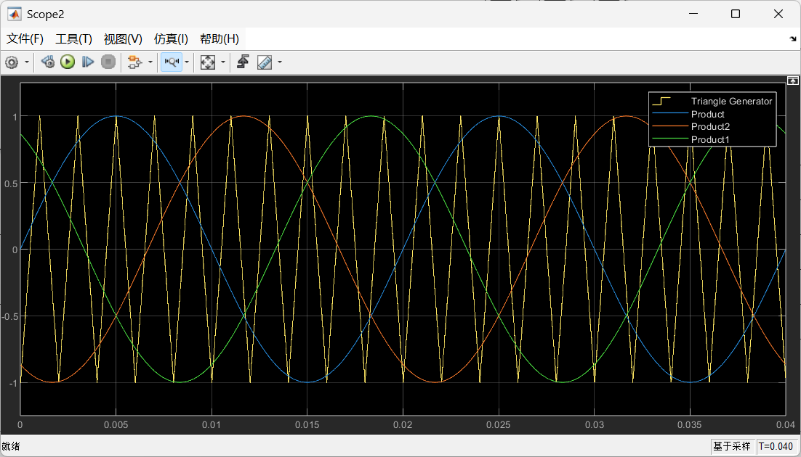

### SPWM信号

分别是UuN'；UvN'；UwN‘；

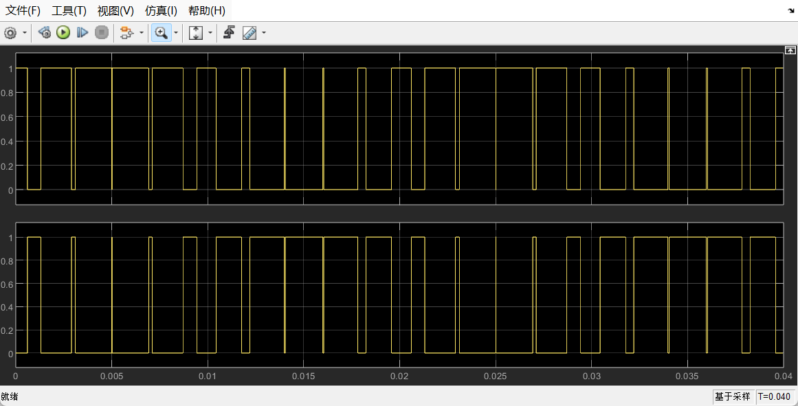

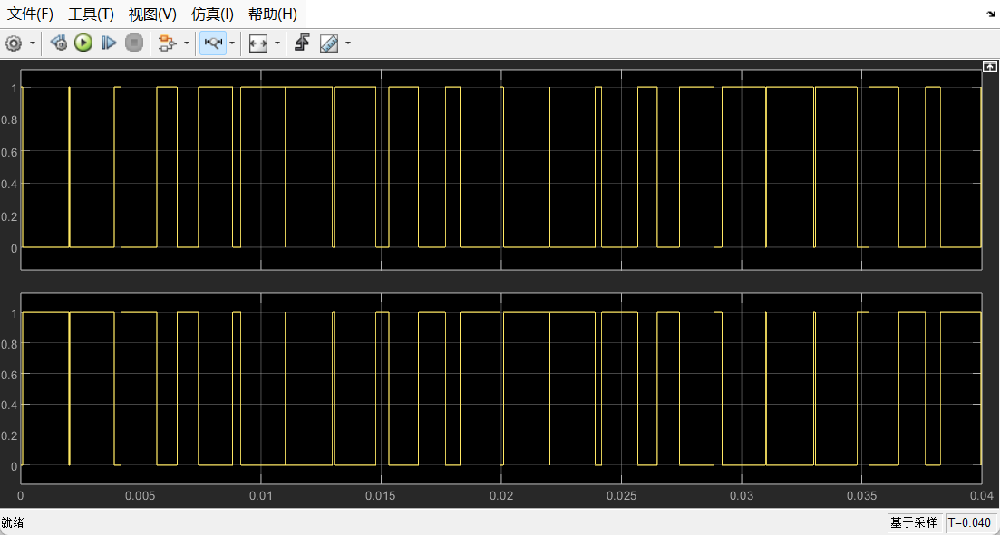

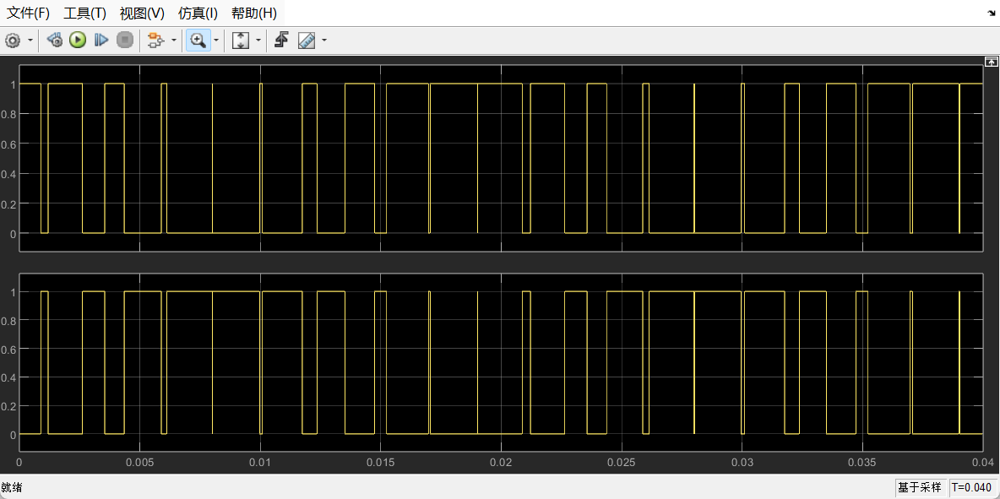

### 桥臂信号（死区）

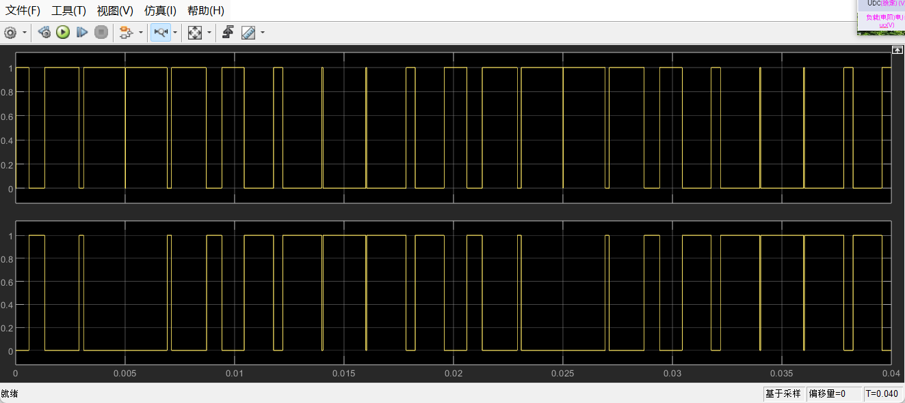

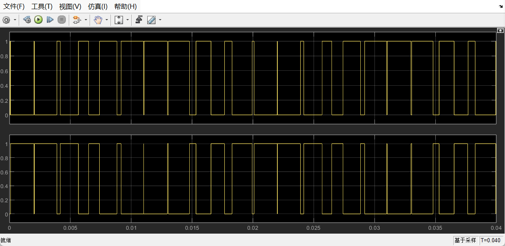

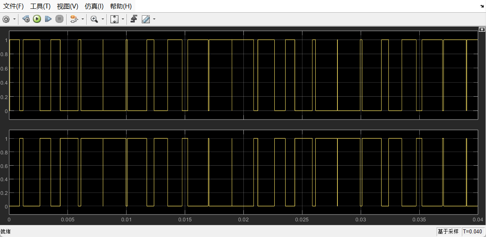

这里提供放大细节部分；

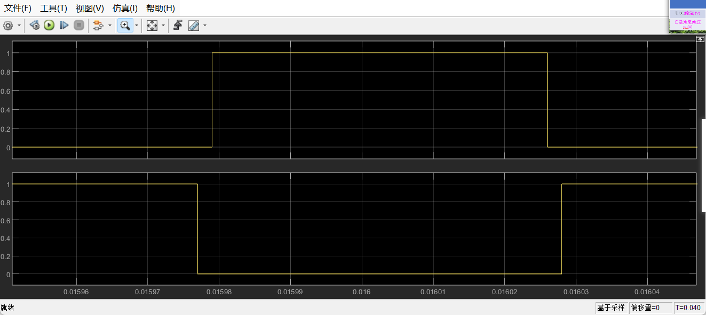

### 桥路输出波形

可以发现和书中或者PPT中参考波形一致。

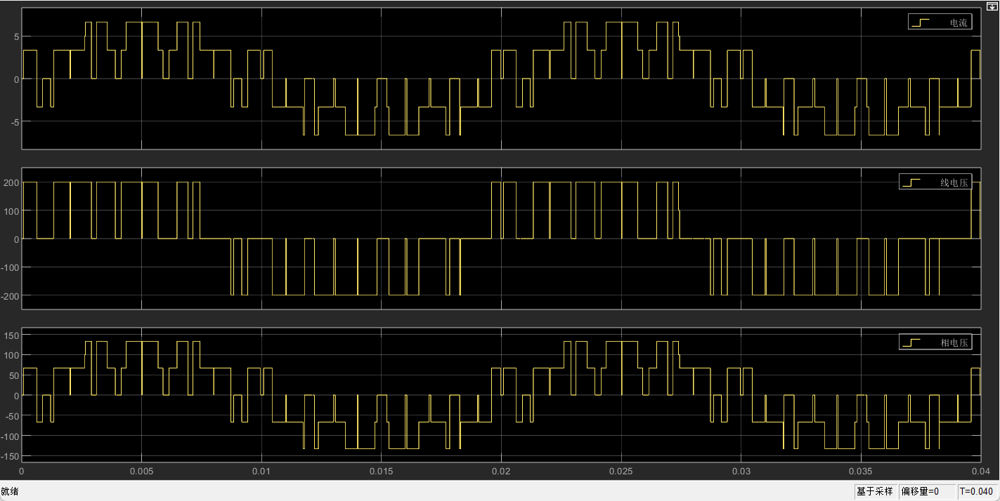

进行FFT分析有

理论的线电压是100根号3=173.205。

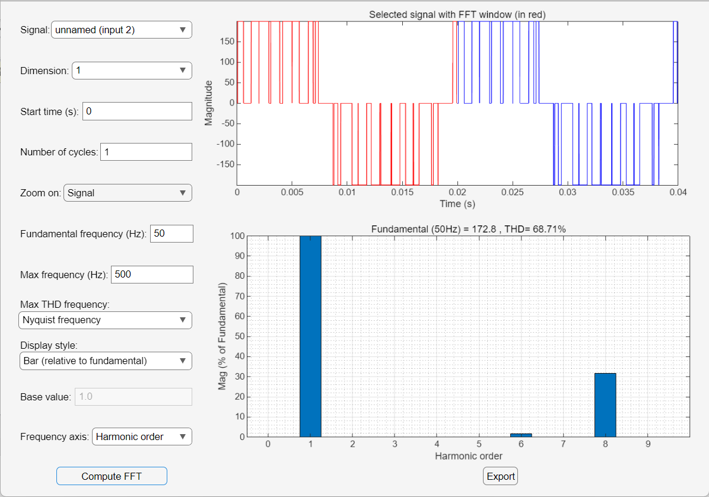
基波的幅值为100V，根据公式Uom = 1/2mUd，Uom理论值为100V。这里是99.74，因为加入了死区，会导致输出略有降低。

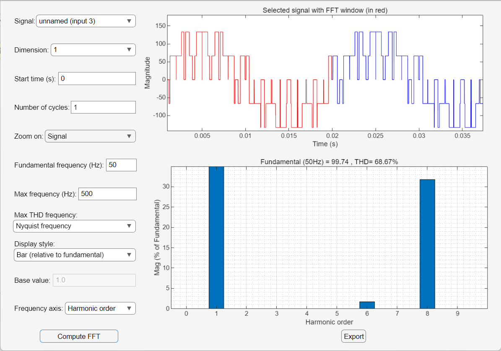

### 滤波后的波形

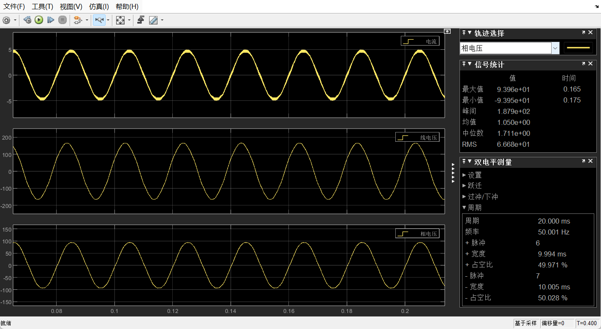

进行FFT分析有

发现引入低通滤波器后，电压幅值与理想值之间有所下降

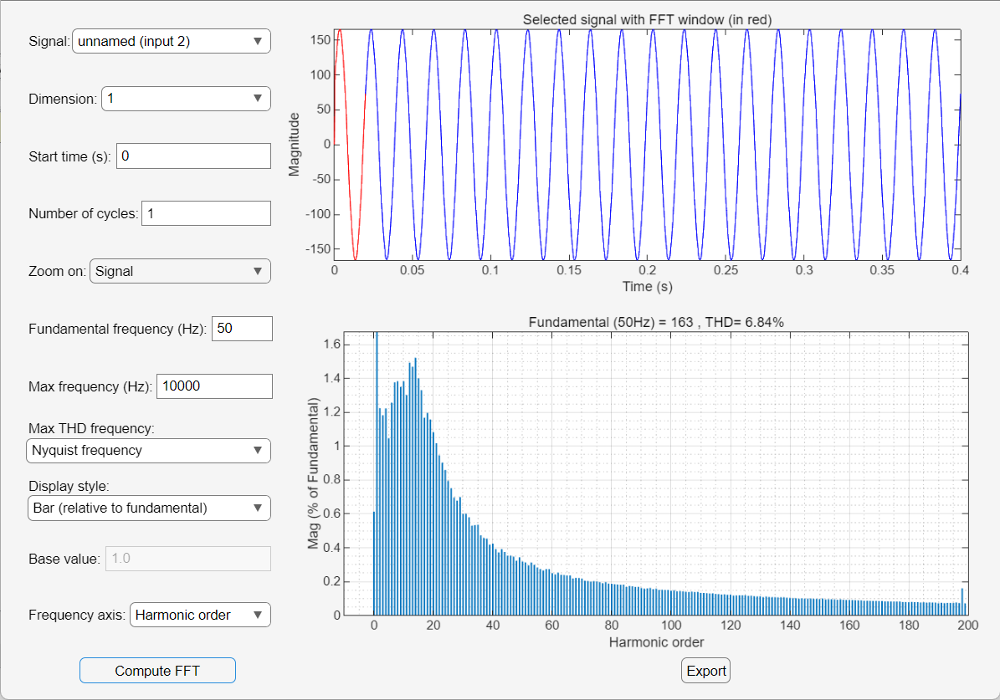

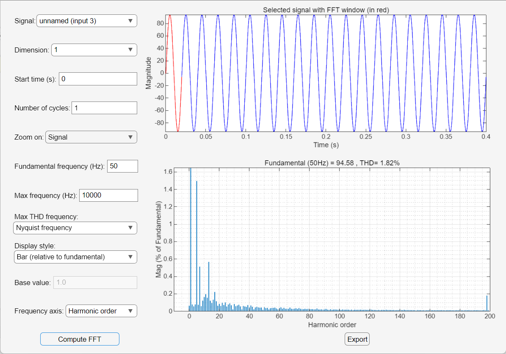

## 数据：

完整实现调频功能，研究fo=f(fr)关系以及对应曲线

调压功能，研究Uo=f(m)、Uo=f(Ud)以及对应的曲线

